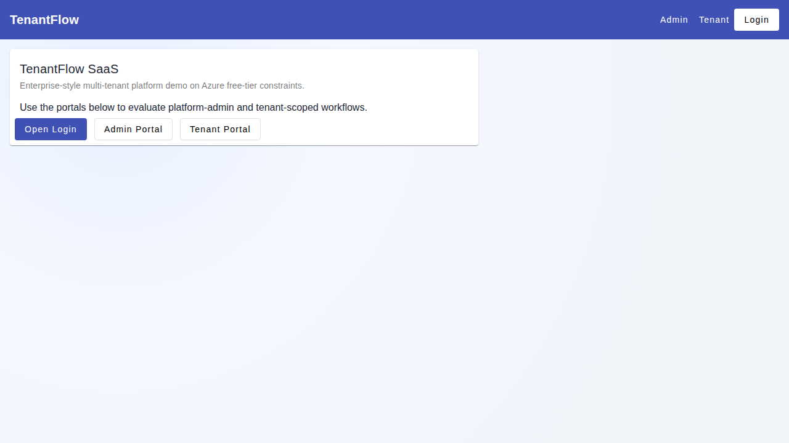
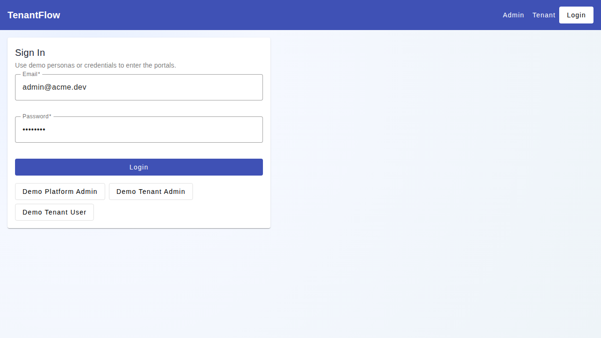
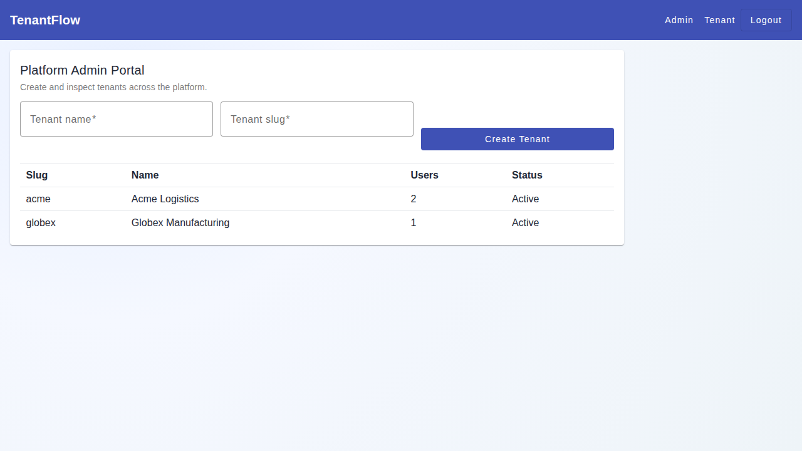
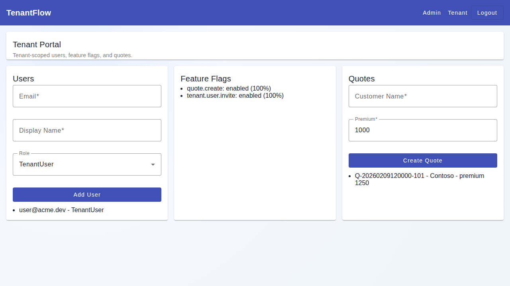

# TenantFlow SaaS

Enterprise-style multi-tenant SaaS reference architecture built with **.NET 10 + Angular 17**.

TenantFlow demonstrates practical patterns that interviewers care about: tenant isolation, RBAC, feature flags, audit trails, usage metering, and tested API/UI flows.

## Demo UI

### Home


### Login


### Platform Admin Portal


### Tenant Portal


## Core Features

- Single-database multi-tenancy (`TenantId` strategy)
- Role-based access control (`PlatformAdmin`, `TenantAdmin`, `TenantUser`)
- Admin and tenant navigation flows in one Angular app
- Tenant-scoped feature flags
- Usage metering + audit logging
- JWT auth with cookie support for browser flows
- Backend integration tests + frontend unit tests + Playwright e2e

## Tech Stack

- Backend: ASP.NET Core (.NET 10), EF Core, SQLite
- Frontend: Angular 17 (standalone components, signals), Angular Material
- Testing: xUnit, Karma/Jasmine, Playwright
- Docs: architecture notes + ADRs in `docs/`

## Repository Structure

- `src/TenantFlow.Api` - API controllers, middleware, services
- `src/TenantFlow.Data` - DbContext, entities, seed data
- `src/TenantFlow.Tests` - integration tests and test host factory
- `client/tenantflow-ui` - Angular application + e2e specs
- `docs` - architecture docs, ADRs, demo screenshots
- `deploy` - free-tier deployment notes

## Local Run

### Prerequisites

- .NET SDK 10+
- Node.js 20+

### Start API

```bash
cd src/TenantFlow.Api
dotnet run
```

### Start UI

```bash
cd client/tenantflow-ui
npm install
npm start
```

Default URLs:

- API: `http://localhost:5000`
- UI: `http://localhost:4200`

## Demo Accounts

Use the login page demo buttons, or manual login with password `Pass123$`.

- `platform@tenantflow.dev` (PlatformAdmin)
- `admin@acme.dev` (TenantAdmin)
- `user@acme.dev` (TenantUser)
- `admin@globex.dev` (TenantAdmin)

## Validation Commands

### Backend

```bash
dotnet build TenantFlow.sln
dotnet test TenantFlow.sln
```

### Frontend

```bash
cd client/tenantflow-ui
npm run test:ci
npm run build
npm run e2e
```

## Key API Routes

- `POST /api/v1/auth/login`
- `POST /api/v1/auth/demo`
- `POST /api/v1/auth/logout`
- `GET, POST /api/v1/admin/tenants`
- `GET /api/v1/admin/usage`
- `GET, PUT /api/v1/admin/feature-flags/{tenantId}`
- `GET, POST, PATCH, DELETE /api/v1/tenant/users`
- `GET /api/v1/tenant/feature-flags`
- `GET, POST /api/v1/quotes`

## Azure Free-Tier Target

- Frontend: Azure Static Web Apps (Free)
- API: Azure App Service (F1)
- Data: SQLite for demo/local, Azure SQL as upgrade path

## Architecture Docs

- `docs/architecture.md`
- `docs/tenancy-model.md`
- `docs/feature-flag-architecture.md`
- `docs/usage-metering.md`
- `docs/decisions/ADR-001-single-db-tenantid.md`
- `docs/decisions/ADR-002-jwt-tenant-context.md`
